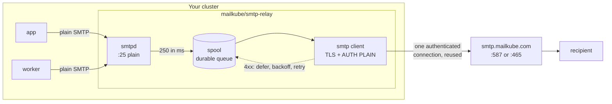
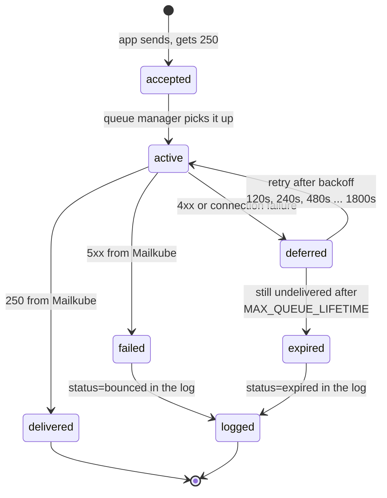
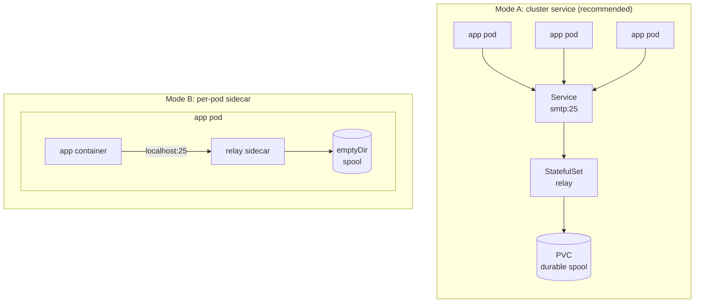
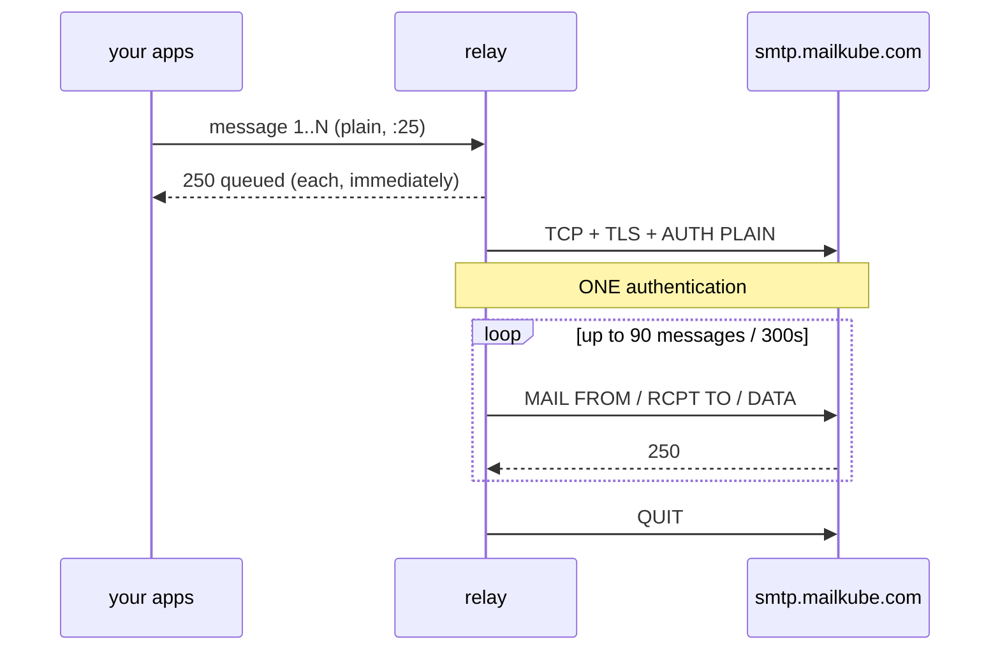

# mailkube/smtp-relay

[](https://github.com/mailkube/mailkube-docker/actions/workflows/ci.yml)
[](https://hub.docker.com/r/mailkube/smtp-relay)
[](https://hub.docker.com/r/mailkube/smtp-relay)
[](LICENSE)
[](CODE_OF_CONDUCT.md)

A companion SMTP relay for [Mailkube](https://mailkube.com). It gives the applications in your
cluster a plain, local SMTP endpoint on port 25, and forwards everything to `smtp.mailkube.com` over
authenticated TLS. The endpoint is **unauthenticated by default**, with
[optional SMTP AUTH and listener TLS](#inbound-authentication-optional) when you want them.

Deploy it as a sidecar or as a cluster-wide service, on Kubernetes, OpenShift, or Docker Compose.

Full product and API documentation: [mailkube.com/docs](https://mailkube.com/docs).

## Quickstart

```bash
docker run -d --name mailkube-relay \
  -e SMTP_USERNAME='myapp01@example.com' \
  -e SMTP_PASSWORD='<your-smtp-credential-secret>' \
  -v mailkube-spool:/var/spool/postfix \
  mailkube/smtp-relay:1
```

Point your application at `mailkube-relay:25` with no username, no password, and no TLS. That is
the whole integration.

```python
import smtplib
from email.message import EmailMessage

msg = EmailMessage()
msg["From"] = "noreply@example.com"      # must be your verified domain
msg["To"] = "customer@example.net"
msg["Subject"] = "Hello"
msg.set_content("Sent through the local relay.")

with smtplib.SMTP("mailkube-relay", 25) as s:   # no login(), no starttls()
    s.send_message(msg)
```

Compose and Kubernetes are covered under [Deployment](#deployment).

## Why run a relay

**Sending stops blocking your request path.** The relay accepts the message into a local Postfix
queue and returns `250` in milliseconds, then delivers in the background. If Mailkube is throttling
you or the network blips, the queue absorbs it and retries with backoff. Without a relay, every
`send()` is a synchronous TLS handshake plus authentication plus delivery, on your user's latency
budget, and a transient failure becomes an application error.

**The credential lives in one place.** One Kubernetes Secret mounted into one workload, instead of
the SMTP password in every service's configuration. Rotating it is one change.

**Legacy applications work unmodified.** Anything that can talk SMTP to `localhost:25`, which is
most software written before 2010, becomes a Mailkube sender with no code change.

**It is not a spam cannon.** The relay is not an open relay, it refuses to start with an
all-addresses ingress rule, and it never invents a sender identity. See
[Security model](#security-model).

## Architecture

### End to end



The dashed edge is the point of the whole thing. A `450` from upstream is a deferral the queue
handles, not an exception your application sees.

### Delivery states



By default a delivery-status notification is **not** generated, because inside a cluster it has
nowhere useful to go and relaying it upstream would be rejected and loop. The log line is the
record. Set `BOUNCE_RECIPIENT` to receive DSNs at an address on your verified domain instead.

### Kubernetes topologies



| | Mode A: cluster service | Mode B: sidecar |
|---|---|---|
| Queue durability | **Survives reschedule** (PVC) | Lost if the pod is deleted (emptyDir) |
| Connection budget | Bounded by replica count you choose | Scales with your app pod count |
| Credential blast radius | One workload | Every app pod |
| Best for | Most deployments | Latency-critical or strongly isolated apps |

Mode A is the default recommendation. Use Mode B when you want the relay's lifecycle tied to the
application's, and accept that an `emptyDir` spool means mail queued at the moment of a pod deletion
is lost.

### Connection reuse



Mailkube permits **2 authentications per second per domain**, and exceeding it is not free: each
rejection raises a risk signal, and enough of them ban your cluster's egress IP. The relay is tuned
so that a full queue drain costs one authentication rather than one per message. Measured: 20
messages sent 3 seconds apart cost **1** authentication. With reuse disabled the same workload costs
20. See [Upstream limits](#upstream-limits-and-how-the-relay-respects-them).

## Prerequisites

1. **A verified domain** in Mailkube.
2. **An SMTP credential** for that domain, created at
   [app.mailkube.com/domain/credentials#smtp](https://app.mailkube.com/domain/credentials#smtp).
   The password is shown once.
3. Outbound access to `smtp.mailkube.com` on port **587** or **465** from your cluster. HTTP and
   SOCKS proxies do not work; Postfix speaks SMTP directly.

Two details that cause most first-run failures:

> **The username is `<username>@<verified-domain>`, not the bare username.**
> Mailkube splits the authentication identity on the `@` to find your domain. `myapp01` fails;
> `myapp01@example.com` works. The relay refuses to start if you get this wrong.

> **The password is the SMTP credential's secret, not your API key.**
> API keys authenticate the REST API. SMTP uses a separate credential. If your password starts with
> `mk_`, the relay warns you about it at startup.

Your message `From` address must also use the verified domain, or Mailkube rejects it with
`550 5.7.1`. See [`ENFORCE_FROM_DOMAIN`](#configuration) if you are migrating an application that
hardcodes something else.

## Configuration

The upstream host is `smtp.mailkube.com` and the port is selectable (587 or 485).

### Credentials

| Variable | Default | Notes |
|---|---|---|
| `SMTP_USERNAME` | *required* | `<username>@<verified-domain>`. A bare username does not authenticate. |
| `SMTP_PASSWORD` | *required* | The SMTP credential secret. Not an API key. |
| `SMTP_USERNAME_FILE` | | Read the value from a mounted file instead. |
| `SMTP_PASSWORD_FILE` | | Read the value from a mounted file instead. Preferred on Kubernetes. |

Both `*_FILE` forms strip trailing whitespace, because `kubectl create secret --from-file` with a
file created by `echo` embeds a newline, and that is the single most common cause of a mysterious
`535`. A missing or unreadable file is a startup error, never a silent skip.

### Upstream and ingress

| Variable | Default | Notes |
|---|---|---|
| `SMTP_PORT` | `587` | `587` (STARTTLS) or `465` (implicit TLS). Nothing else is accepted. |
| `LISTEN_PORT` | `25` | The port the relay listens on. Set to e.g. `1025` to drop `NET_BIND_SERVICE`. |
| `RELAY_NETWORKS` | | Extra CIDRs allowed to send, comma separated. |
| `RELAY_NETWORKS_MODE` | `append` | `append` adds to the private-range defaults; `replace` uses only your list. Loopback is always kept. |
| `RELAY_HOSTNAME` | `mailkube-relay.<domain>` | The relay's own hostname in its SMTP banner. |
| `INET_PROTOCOLS` | `all` | Set `ipv4` on clusters with no IPv6 route. |

### Limits and pacing

| Variable | Default | Notes |
|---|---|---|
| `MESSAGE_SIZE_LIMIT` | `20971520` | 20 MiB, matching the upstream listener cap. |
| `RECIPIENT_LIMIT` | `50` | Recipients per delivery batch. |
| `MAX_QUEUE_LIFETIME` | `1d` | How long to keep retrying. Set `1h` for OTP and password-reset traffic. |
| `RELAY_CONCURRENCY` | `2` | Parallel connections upstream. Read the fleet rule below before raising. |
| `RELAY_MSG_RATE` | | Your plan's messages/second. `1` or lower enables a 1s pacing delay. |

> **Fleet rule:** `instances × RELAY_CONCURRENCY ≤ 18`. Mailkube's edge rejects at 20 concurrent
> connections **per source IP**, which is your cluster's shared egress NAT address, not per pod. Nine
> relay replicas at the default concurrency fit. In sidecar mode "instances" is your application pod
> count, so cap it at roughly 8 app pods per egress address.

`RELAY_MSG_RATE` is off by default because we cannot know your plan from inside the container, and
Postfix's minimum pacing interval is one second, which would throttle higher tiers by 6x. Enabling
any pacing collapses concurrency to 1; that is Postfix behaviour, not a choice this image makes.

### Inbound authentication (optional)

The listener is unauthenticated by default. Setting accounts turns on SMTP AUTH so clients identify
themselves, which lets you narrow `mynetworks` and stop trusting the network alone.

| Variable | Default | Notes |
|---|---|---|
| `RELAY_AUTH_USERS` | | Comma-separated `user:password` pairs. Fine for local work. |
| `RELAY_AUTH_USERS_FILE` | | One `user:password` per line from a mounted file. Use this on Kubernetes. |
| `RELAY_AUTH_REQUIRED` | `no` | `yes` drops `permit_mynetworks`, so every client must authenticate. |
| `RELAY_TLS_CERT_FILE` | | Certificate for the listener. Enables mandatory STARTTLS. |
| `RELAY_TLS_KEY_FILE` | | Its private key. Both must be set together. |

```bash
docker run -d --name mailkube-relay \
  -e SMTP_USERNAME='myapp01@example.com' \
  -e SMTP_PASSWORD='<your-smtp-credential-secret>' \
  -e RELAY_AUTH_USERS_FILE=/run/secrets/relay-accounts \
  -e RELAY_AUTH_REQUIRED=yes \
  -e RELAY_TLS_CERT_FILE=/tls/tls.crt -e RELAY_TLS_KEY_FILE=/tls/tls.key \
  -e RELAY_NETWORKS_MODE=replace -e RELAY_NETWORKS=10.42.0.0/16 \
  -v ./accounts:/run/secrets/relay-accounts:ro -v ./tls:/tls:ro \
  -v mailkube-spool:/var/spool/postfix \
  mailkube/smtp-relay:1
```

Clients then authenticate with a plain username and password over STARTTLS. `AUTH PLAIN` and
`AUTH LOGIN` are both offered.

Three things worth knowing:

- **Certificates are mounted, never generated.** Creating a self-signed certificate at startup would
  force every client to disable verification, which trains people to accept any certificate. Use
  cert-manager or your own PKI.
- **With a certificate set, `AUTH` is refused until `STARTTLS`** (`smtpd_tls_auth_only`), so a client
  cannot be downgraded into sending its password in the clear. Without one, the relay still accepts
  authentication but warns loudly at startup that passwords cross the network base64-encoded.
- **`RELAY_AUTH_REQUIRED=yes` needs at least one account** or the relay refuses to start, since it
  would otherwise reject every client including its own healthcheck.

Authentication is about *who may submit to the relay*. It is unrelated to the credential the relay
uses to authenticate to Mailkube, which is always required.

### Behaviour and lifecycle

| Variable | Default | Notes |
|---|---|---|
| `BOUNCE_RECIPIENT` | | Deliver DSNs here instead of discarding them. Must be on your verified domain. |
| `ENFORCE_FROM_DOMAIN` | `no` | Rewrite non-compliant `From` domains to your verified domain, preserving the local part. |
| `SMTPUTF8_ENABLE` | `no` | |
| `SHUTDOWN_DRAIN_TIMEOUT` | `20` | Seconds to drain the queue on SIGTERM. Keep below your grace period. |
| `RELAY_START_JITTER` | `15` | Random startup delay, decorrelating multi-replica cold starts. Set `0` in tests. |
| `TZ` | `UTC` | |
| `RELAY_DEBUG` | `no` | Verbose tracing. Never echoes the credential. |
| `RELAY_IGNORE_LEGACY_ENV` | `no` | Downgrade removed-variable errors to warnings while migrating. |

`ENFORCE_FROM_DOMAIN` is a migration aid, not a recommendation. It converts a hard `550` from a
legacy application into a working send, but the correct fix is for the application to send a
compliant `From`. It rewrites only addresses whose domain does not already match, and preserves the
local part, so `wordpress@localhost` becomes `wordpress@example.com`.

## Deployment

### Docker Compose

```yaml
services:
  mailkube-relay:
    image: mailkube/smtp-relay:1.0.0
    restart: unless-stopped
    env_file: .env
    volumes:
      - relay-spool:/var/spool/postfix   # durable queue
      - relay-data:/var/lib/postfix      # per-instance, never share
    stop_grace_period: 60s
    # No healthcheck block: the image ships one, and
    # `depends_on: condition: service_healthy` works off it directly.

volumes:
  relay-spool:
  relay-data:
```

Ready-made variants: [`examples/compose/basic`](examples/compose/basic),
[`with-metrics`](examples/compose/with-metrics), [`hardened`](examples/compose/hardened).

### Kubernetes

Complete manifests are in [`examples/kubernetes/`](examples/kubernetes). Apply them in order; the
important parts are summarized here.

```bash
kubectl apply -f examples/kubernetes/
```

The security context below is not aspirational; it is exactly what the test suite runs the full
delivery path under.

```yaml
securityContext:
  runAsNonRoot: false          # Postfix's master genuinely requires root
  runAsUser: 0
  allowPrivilegeEscalation: false
  readOnlyRootFilesystem: true
  capabilities:
    drop: ["ALL"]
    add: ["CHOWN", "DAC_OVERRIDE", "FOWNER", "SETGID", "SETUID", "NET_BIND_SERVICE"]
  seccompProfile:
    type: RuntimeDefault
```

Postfix's `master` spawns its children under different user IDs and refuses to run as an arbitrary
one, so this image runs as root with almost every capability dropped rather than pretending
otherwise. `NET_BIND_SERVICE` is needed only for port 25; set `LISTEN_PORT=1025` and drop it, and
have the Service map `port: 25` to `targetPort: 1025` so applications still dial port 25.

Three things people get wrong:

- **`/var/lib/postfix` must be a per-pod `emptyDir`.** Two pods sharing it means Postfix refuses to
  start. Only `/var/spool/postfix` belongs on a PVC.
- **The PVC must support unix domain sockets.** Prefer block-backed RWO storage; some NFS and CSI
  drivers break Postfix's `private/` and `public/` sockets.
- **Kubernetes ignores the image's `HEALTHCHECK`.** Define probes explicitly; the manifests do.

### OpenShift

The default `restricted-v2` SCC assigns a random UID and forbids root, and this image will not run
under it. A custom SCC is required. See [`examples/openshift/`](examples/openshift) for the SCC and
the `oc adm policy` command.

## Upstream limits and how the relay respects them

| Mailkube limit | Value | What the relay does | If you exceed it |
|---|---|---|---|
| Authentications | 2/sec per domain | Reuses one authenticated connection for up to 90 messages | `454 4.7.0`, plus a risk signal |
| Concurrent connections | 20 per source IP | `RELAY_CONCURRENCY=2`, ramping from 1 on cold start | TCP reject, no SMTP reply |
| Messages | 1 to 6/sec by plan | Queues and retries; optional `RELAY_MSG_RATE` pacing | `450 4.7.1`, plus a risk signal |
| Message size | 10/15/25 MB by plan, 20 MiB at the edge | Rejects locally at `MESSAGE_SIZE_LIMIT` | `552` locally, or `5.3.4` upstream |
| Recipients | 1 to 50 by plan | Splits into batches of `RECIPIENT_LIMIT` | `5.5.3` |
| Submission ports | 587, 465 | Refuses any other value | n/a |

> **Rate rejections are not free.** Every `450` and `454` raises a risk signal against the
> connecting IP. 100 message-rate rejections in 30 minutes, or 20 authentication-rate rejections in
> 15 minutes, ban that IP for 10 minutes to 24 hours. The ban is a TCP reject with no SMTP reply, on
> all submission ports, and the banned address is your cluster's shared egress NAT, so one noisy
> application takes down every other sender behind it.

This is the reason the relay's defaults are conservative: concurrency of 2, a cold-start ramp from
1, a 120-second retry floor, and startup jitter. Raising them without reading
[`.rules/POSTFIX_TUNING.md`](.rules/POSTFIX_TUNING.md) is how you get banned.

## Mailkube headers

These headers pass through **byte for byte**. The relay never adds, strips, or rewrites them.

| Header | Purpose |
|---|---|
| `X-Mailkube-Template-Id` | Render a stored template server side |
| `X-Mailkube-Template-Version` | A version number, or `latest` |
| `X-Mailkube-Template-Variables` | JSON object of template variables |
| `X-Mailkube-Topic` | Subscription topic, drives opt-out handling |
| `X-Mailkube-Tags` | JSON array of `{"name":...,"value":...}` |

> **Keep every physical header line at or below 998 bytes**, including the field name.
> SMTP breaks longer lines by inserting a line break and a space at a fixed byte offset, with no
> regard for token boundaries. Inside a JSON string value that produces a *silently corrupted*
> variable rather than an error, because the JSON stays syntactically valid. For payloads larger
> than that, use the REST API.

## Observability

Postfix logs to stdout. These are the lines worth alerting on.

| Pattern | Meaning |
|---|---|
| `status=sent` | Delivered |
| `status=deferred` | Will retry; sustained growth means a real problem |
| `status=bounced` | Permanent rejection, with the upstream reason quoted inline |
| `status=expired` | Gave up after `MAX_QUEUE_LIFETIME`. **Investigate: this is lost mail.** |
| `mailkube-relay: drain-incomplete undelivered=N` | Shut down with mail still queued |
| `454 4.7.0` / `450 4.7.1` | Rate limited. Count these; they lead to a ban. |
| `Connection reset by peer` with no 4xx | Likely already banned. See Troubleshooting. |

Queue depth: `docker exec mailkube-relay postqueue -c /run/postfix -p`.

For Prometheus, run a `postfix_exporter` sidecar against the shared spool volume. See
[`examples/compose/with-metrics`](examples/compose/with-metrics) and
[`examples/kubernetes/40-servicemonitor.yaml`](examples/kubernetes/40-servicemonitor.yaml).

## Error codes

| Code | Meaning | What to do |
|---|---|---|
| `5.7.8` | Bad credentials | Check the username is `user@domain` and the password is an SMTP credential |
| `5.7.1` | `From` domain does not match | Fix the sender, or set `ENFORCE_FROM_DOMAIN=yes` |
| `4.7.0` | Authentication throttled | Transient. Persistent means connection reuse is broken |
| `4.7.1` | Message rate exceeded | Transient. Consider `RELAY_MSG_RATE` |
| `5.3.4` | Message too large | Check your plan's limit |
| `5.5.3` | Too many recipients | Lower `RECIPIENT_LIMIT` |
| `5.6.0` | Invalid content, tags, or template | Check the `X-Mailkube-*` headers |
| `5.7.0` | Quota exceeded | Check your plan usage |

The full reference is at [mailkube.com/docs](https://mailkube.com/docs).

## Security model

**The listener is unauthenticated by default.** Anything that can reach port 25 can send mail as your
verified domain. That is the trade: you move authentication to the network boundary in exchange for
zero-configuration clients. If that trade does not suit you, turn on
[inbound authentication](#inbound-authentication-optional) and narrow `mynetworks`.

Consequently:

- **Network isolation is the actual control.** Ship
  [`30-networkpolicy.yaml`](examples/kubernetes/30-networkpolicy.yaml). Restrict ingress to the pods
  that should be sending. Some CNIs do not enforce NetworkPolicy; check yours.
- **Never publish the port.** No `LoadBalancer`, no host port, no `-p 0.0.0.0:25:25`.
- `mynetworks` defaults to private ranges only, and the relay **refuses to start** if you give it a
  `/0` CIDR. Use `RELAY_NETWORKS_MODE=replace` to narrow it to exactly your pod CIDR.
- Traffic to Mailkube uses **verified** TLS, meaning mandatory encryption with certificate
  validation against the hostname. A downgrade or interception attempt fails closed.
- The credential is written to tmpfs, never to an image layer or a disk-backed volume.
- If you use Mailkube's per-credential source IP allowlist, add your cluster's egress NAT address.

## Troubleshooting

| Symptom | Cause | Fix |
|---|---|---|
| Container exits immediately with a `fatal:` line | Configuration rejected at startup | The message names the variable and the fix |
| `no worthy mechs found` | SASL cannot negotiate | Report a bug; the image pins this correctly |
| `535` on every send | Wrong credential | Username must be `user@domain`; password is not an API key |
| `550 ... From address must match` | Sender domain mismatch | Fix the app, or `ENFORCE_FROM_DOMAIN=yes` |
| Queue grows, no upstream errors | Cannot reach Mailkube | Check egress on 587; proxies do not work |
| `Connection reset by peer`, no 4xx lines | Egress IP is banned | Wait it out; find the app generating rate rejections |
| Repeated `454 4.7.0` | Connection reuse broken | Check `conn_use=` appears in the log; open an issue |
| Pod not ready during rollout | Probes missing | Use the manifests in `examples/kubernetes/` |

## Image tags

| Tag | Moves | Use for |
|---|---|---|
| `1.2.3` | Never | Production |
| `1.2` | Patches | Production, if you want patches automatically |
| `1` | Minors and patches | Convenience |
| `latest` | Every release | Local experimentation only |
| `edge` | Every merge to `main` | Testing unreleased changes |

Images are multi-arch (`linux/amd64`, `linux/arm64`), built with SBOM and provenance attestations,
and signed with cosign:

```bash
cosign verify docker.io/mailkube/smtp-relay:1.0.0 \
  --certificate-identity-regexp '^https://github.com/mailkube/mailkube-docker/' \
  --certificate-oidc-issuer https://token.actions.githubusercontent.com
```

## Contributing

See [CONTRIBUTING.md](CONTRIBUTING.md) for the development setup and the quality gates every change
must pass. The `.rules/` directory documents the invariants, and
[`.rules/UPSTREAM_CONTRACT.md`](.rules/UPSTREAM_CONTRACT.md) in particular records facts that must
never be re-derived. Security issues: see [SECURITY.md](SECURITY.md).

## License

[Apache-2.0](LICENSE) © 2026 Mailtactic, Corp.
